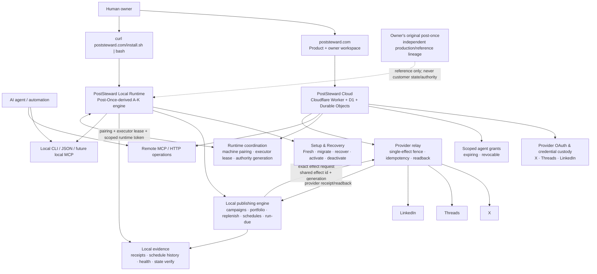
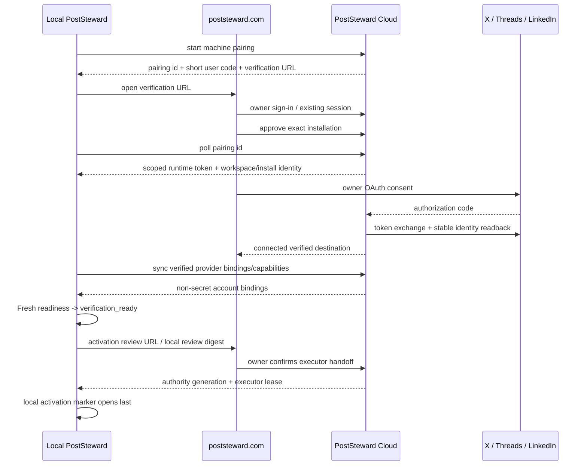

# PostSteward final product architecture

**Status:** canonical target architecture  
**Product:** PostSteward  
**Public product/repository:** `AyobamiH/poststeward` / `https://poststeward.com`  
**Local runtime lineage:** Post-Once-derived, graduated from `AyobamiH/post-once-bootstrap` Milestones A-K  
**Historical owner runtime:** `AyobamiH/post-once` remains independent and is never a customer installation target

> This document is the architecture authority for future implementation agents.
> Do not collapse PostSteward back into a thin hosted API client, and do not expose
> `post-once-bootstrap` as a separate end-user product.

## 1. Product definition

PostSteward is a **distributed, human-governed and agent-operable social publishing system**.

It has two cooperating planes:

1. **PostSteward Cloud** — identity, workspace, provider OAuth/credential custody,
   owner administration, machine coordination, billing, remote MCP/HTTP, agent grants,
   provider capability evidence and the provider relay.
2. **PostSteward Local Runtime** — the independently installable Post-Once-derived
   engine: durable local state, campaigns, scheduling, portfolio/replenishment,
   receipts, health/capability inspection, Setup & Recovery, activation/deactivation,
   migration, recovery and local agent operation.

The public installation experience is:

```bash
curl -fsSL --proto '=https' --tlsv1.2 https://poststeward.com/install.sh | bash
```

The user should not need to know the names `post-once-bootstrap`, `ocpf_post`, or
the owner's original `post-once` repository.

## 2. Final-product diagram



## 3. The most important invariant: one executor authority

PostSteward must never allow the hosted scheduler and a local runtime to independently
believe they may publish the same account/workspace work.

Every consequence-capable route is fenced by an explicit executor record:

```text
workspace
  executor_mode: hosted | local
  active_installation_id: <id or null>
  authority_generation: <integer>
  status: active | inactive | recovery_review
```

For local execution, every provider-effect request must prove:

```text
workspace.executor_mode == local
workspace.active_installation_id == request.installation_id
workspace.authority_generation == request.authority_generation
local automation marker == active for same operation/install/generation
runtime token == valid + unexpired + bound to same installation/workspace
effect id == unused or exact idempotent replay
account binding == exact verified provider identity
text hash == exact reviewed local payload
```

Failure is fail-closed.

### Why the provider relay exists

Provider OAuth secrets stay in PostSteward Cloud. The local runtime owns planning,
scheduling and effect intent, but Cloud performs the final provider HTTP request as a
**credential relay**, not as a competing scheduler.

This gives one consequence path:

```text
local durable schedule
-> local run-due claims one effect
-> exact local effect id + text/account hash
-> PostSteward provider relay
-> provider
-> hosted effect receipt/readback
-> same receipt mirrored into local durable evidence
```

The relay must never invent new scheduling authority, rewrite local campaign intent,
or blind-retry an ambiguous provider result.

## 4. Repository roles

### `AyobamiH/poststeward`

Canonical public product repository.

Owns:

- public website and docs;
- `poststeward.com/install.sh`;
- installable PostSteward client/runtime packaging;
- Cloudflare hosted control plane;
- X / Threads / LinkedIn OAuth;
- workspace identity and account routing;
- runtime pairing and executor fencing;
- remote HTTP/MCP;
- agent grants;
- provider relay;
- billing and product lifecycle;
- the vendored/adopted local runtime source used for public releases.

### `AyobamiH/post-once-bootstrap`

Incubation/evidence lineage.

Its A-K work is the provenance of the PostSteward local runtime:

- standalone XDG identity;
- exact-revision installer;
- Fresh/explore/migrate/recover setup;
- host admission;
- SetupEngine and durable setup store;
- provider identity/readiness verification;
- activation/deactivation authority marker;
- systemd user automation;
- runtime upgrade/rollback;
- transfer bundles;
- dead-host recovery;
- adversarial acceptance;
- limited-beta evidence and the real owner-canary.

It is **not** a second public product.

New customer-facing runtime work belongs in `AyobamiH/poststeward` after the runtime
snapshot is adopted there.

### `AyobamiH/post-once`

Owner's historical production runtime and reference lineage.

It is never:

- modified by PostSteward installation;
- used as a customer install source;
- used as a customer config/state root;
- silently merged into PostSteward;
- assumed to be byte-for-byte identical to the PostSteward runtime.

Useful later changes may be deliberately ported only with review and regression proof.

## 5. Installation architecture

The installer follows the same high-level product pattern proven by mature local-agent
products such as OpenClaw:

- a canonical HTTPS installer URL;
- macOS/Linux/WSL support first;
- no-root user-local prefix;
- `--no-onboard`;
- `--dry-run`;
- exact version/revision installs;
- post-install verification;
- guided onboarding after install;
- stable and beta update channels;
- future native Windows installer/PowerShell path.

Target user-local layout:

```text
~/.local/bin/poststeward
~/.local/share/poststeward/
  runtime/
  releases/
  client/
~/.local/state/poststeward/
  runtime/
  setup/
  install.json
  pairing.json
~/.config/poststeward/
  client.json
  runtime/
```

The canonical command is always `poststeward`. Historical internal Python/package
names may remain behind the product boundary until intentionally migrated.

## 6. Onboarding architecture



Provider setup is first-class for all three:

- X;
- Threads;
- LinkedIn member;
- LinkedIn organization/Page where the dedicated organization OAuth application and
  required scopes are available.

Application configuration, OAuth consent, identity verification, account activation,
executor activation and actual publication remain distinct states.

## 7. Human and agent authority

Humans own:

- sign-in;
- provider OAuth;
- account/Page selection;
- machine pairing approval;
- execution-mode changes;
- activation/deactivation review;
- grant issuance/revocation;
- billing;
- migration/recovery decisions;
- destructive lifecycle actions.

Agents may receive bounded authority for:

- inspection;
- project/campaign work;
- schedules;
- approved publishing;
- portfolio/replenishment operations;
- receipt/readback inspection;
- metrics;
- health/status.

An agent token never grants owner/admin authority.

## 8. Local runtime capabilities that must survive graduation

The final PostSteward local runtime must preserve the useful Post-Once-derived
capabilities, including:

- runtime project/account registry;
- approved immutable campaigns;
- direct and scheduled publication;
- durable schedule/event history;
- no-blind-replay semantics;
- provider receipts/readback;
- portfolio planning/refill;
- replenishment and source observation;
- vault/editorial ingestion where configured;
- health/capabilities/state verification;
- performance/metrics evidence;
- reply/conversation machinery when deliberately ported;
- setup/admission;
- activation/deactivation;
- runtime upgrade/rollback;
- migration;
- dead-host recovery;
- evidence export;
- deterministic JSON command discovery.

The product may change implementation details, but must not silently regress the
consequence and evidence boundaries proven by A-K.

## 9. Cloud capabilities

The hosted side owns:

- workspace/account identity;
- provider OAuth applications and secret custody;
- exact stable provider identity evidence;
- machine pairing;
- runtime-token lifecycle;
- executor lease/generation;
- provider effect relay;
- hosted receipt mirror;
- remote MCP/HTTP;
- agent grants;
- billing/entitlement;
- release metadata and update channel;
- public docs/support/status.

The cloud does **not** become a second autonomous scheduler when local execution is
active.

## 10. Execution modes

### Hosted mode

Existing PostSteward hosted scheduling/publishing is authoritative.

A local client may inspect and invoke hosted operations but does not run an active
local publishing scheduler for the same workspace.

### Local mode

The PostSteward local runtime is the sole scheduling/planning authority.

Hosted PostSteward:

- keeps credentials;
- fences the active installation/generation;
- relays exact provider effects;
- stores a mirror receipt;
- exposes remote observability/agent access.

Hosted publish/schedule operations that would compete with the active local executor
must fail closed.

### Transition

Changing modes is a reviewed handoff, not a boolean toggle:

```text
PREVIEW
-> drain old executor
-> reconcile outstanding/ambiguous effects
-> advance authority generation
-> bind target executor
-> dry checks
-> activate target
-> attest
```

## 11. Failure and recovery rules

- Ambiguous provider effect is terminal review evidence, never retry authority.
- Partial effect is terminal review evidence.
- Lost local machine does not imply its credentials/lease were safely revoked.
- Cloud executor lease expiry stops new relay effects but does not rewrite history.
- Recovery advances generation only after explicit review.
- Overdue restored schedules do not catch up automatically.
- Local deactivation closes the automation marker before stopping timers.
- Cloud deactivation/fencing closes relay authority before any hosted cleanup.
- Migration/recovery bundles remain credential-free.
- Provider credentials are re-authorised or remain hosted; they are never placed in
  portable state bundles.

## 12. Update/release model

A public PostSteward release identifies both:

```text
cloud_release_sha
local_runtime_release
local_runtime_source_provenance
minimum_compatible_runtime
maximum_compatible_runtime (when needed)
```

The installer defaults to the stable channel. Beta testers may opt into beta.

Runtime upgrade remains preview/prove/promote/readback/rollback rather than replacing
files in place.

## 13. Anti-confusion rules for future agents

Do **not**:

1. market `post-once-bootstrap` separately;
2. direct customers to clone `AyobamiH/post-once`;
3. replace the local runtime with a thin HTTP bookmark;
4. copy provider OAuth secrets into portable migration bundles;
5. let hosted and local schedulers publish the same authority generation;
6. equate application configuration with a connected provider account;
7. infer publication from a request being sent;
8. retry ambiguous effects with a new idempotency key;
9. mutate the owner's original Post-Once while implementing PostSteward;
10. call a green CI run equivalent to real external acceptance.

## 14. Definition of final product

A fresh external user can:

1. run the one-line installer;
2. obtain a real isolated PostSteward local runtime;
3. pair that runtime to a PostSteward workspace;
4. connect X, Threads and LinkedIn from the owner surface;
5. verify exact destination identity/capabilities;
6. configure projects/campaigns/portfolio;
7. activate local execution through a reviewed one-writer handoff;
8. let local or remote agents operate within scoped authority;
9. publish/schedule through one fenced provider-effect path;
10. inspect matching local + hosted receipts;
11. deactivate, upgrade, migrate or recover without losing consequence history.

That is the target architecture.