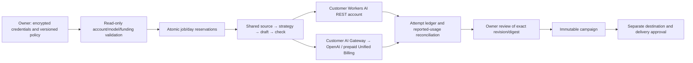

# Owner model selection and funding

Reviewed 1 October 2026. This extends the existing hosted Preparation orchestrator,
not publication authority or the independent original Post-Once installation.

## Configuration and custody

`model_connect.routing` version 1 separates provider, reviewed model, funding,
32-character Cloudflare account ID and optional gateway ID. It includes UTF-8 input
and output limits, temperature, job/UTC-day USD ceilings, an optional single fallback
(default off), log preference (`none`/payload-free `metadata`) and private preparation
retention (`reviewed_removal`). Existing reviewed export/removal is the only content
retention policy supported; operation/usage evidence and immutable campaigns remain.
Provider retention follows provider terms: neither disabling gateway logs nor requesting
OpenAI `store:false` guarantees zero retention. No gateway settings are changed.

Secrets use existing workspace-bound encryption and root rotation. The internal
`model:openai` record/context is intentionally retained for compatibility with recovery
and root inventories; it is not the external provider name. The encrypted envelope holds
an inference token and optionally a separate read-only inspection token. Credentials
never enter model input, response/status, local campaign exports or agents. Clearing
model access fences future calls; revoke the token at its issuer to revoke external use.
Saving/rotating policy increments authority version without resetting accumulated usage.
Existing direct OpenAI connections and their previous quotas remain compatible.

Use purpose-built account-scoped Cloudflare tokens, never a global API key:
- Workers AI REST/catalogue: Workers AI Read on the selected customer account.
- Gateway passthrough: AI Gateway Run; use an optional inspection token with AI Gateway
  Read and the billing inspection permission required by that customer's account.
- Missing inspection permission blocks credit routing. Broader Edit access is not requested.

AI Gateway permissions apply across the account's gateways, not just the configured
ID. A Run token may access stored provider credentials elsewhere in that account.
A separate customer account and dedicated key-free gateway reduce this residual scope.
The account/gateway ID belongs to private workspace status, not public readiness.

## Model availability and funding

Reviewed models: Workers AI Llama 3.3 70B FP8 fast / Llama 3.1 8B; Gateway OpenAI
GPT-4.1 mini / GPT-4.1. All use the same structured editorial schema and grounded checks.
Model IDs/endpoints are allowlisted, never supplied arbitrary URLs. Workers search
validates hosted availability. Gateway model availability/Responses capability/pricing
comes from the current official public catalogue, without customer auth headers.
This proves catalogue listing, not live customer eligibility. Account routing is checked
separately and successful bounded inference is still required for acceptance.

Workers direct uses the customer's `/accounts/{id}/ai/run/{model}` endpoint, never
PostSteward's hosting AI binding. Workers credit mode requires the selected gateway's
explicit `workers_ai_billing_mode:unified` and gateway header. OpenAI uses the customer
Gateway `/openai/responses`, only Cloudflare gateway authentication, no OpenAI key.

Before each credit-funded attempt, inspect the exact gateway, full bounded/paginated
OpenAI key inventory, retries and positive shared account credit balance. Any stored
OpenAI key is rejected, including non-default aliases (deliberately stricter than
Unified endpoints' default-alias precedence). Require a positive enabled gateway-wide
cost spend rule; scoped rules that might miss our requests do not suffice. Owners must
configure this themselves; PostSteward never creates/edits gateways, purchases credits,
changes auto-top-up, payment arrangements or falls back to service-funded inference.
A returned OpenAI response must also attest `gatewayMetadata.keySource:Unified`;
missing/BYOK attribution blocks results and retains uncertain allowance.

Configuration inspection is not an invoice. External key changes can race inspection
and inference; the request can already cost money before a bad response is detected.
Dedicated immutable customer configuration is recommended. An external dashboard/
billing readback is required for real funding proof. Balance is provider-reported,
shared account data, not exclusive workspace credit; its API unit is not relabelled USD.

## Reservations, attempts and fallback

For each job reserve every remaining phase and explicitly allowed fallback using
conservative input-byte/output-token upper bounds, reviewed prices and a 5% credit
purchase-fee allocation. Integer micro-USD accounting is transactional in the existing
workspace store. Admission checks daily reserved + settled + uncertain against the
owner ceiling; job totals survive UTC rollover. The complete request, including schema,
is bounded before I/O. Prices expire after 30 days; Gateway published price changes
block generation pending code review. Estimates are not exact invoices or financial
spend guarantees: provider accounting can differ or change between checks.

Before I/O, move an attempt's reserved allowance to an independent uncertain ledger.
On bounded valid reported usage, move it to settled estimated cost and release the
excess. Failed, malformed, cancelled-in-flight and timeout attempts conservatively
retain their maximum allowance. Terminal jobs release only unattempted reservations.
Late usage can settle even after cancellation without reviving content or refunding a
new generation's budget. Recovery releases unattempted reservations and fences model
credentials; historical uncertain attempts remain. No blind replay after a lost claim.

Gateway secondary spend limits record cost after completion and are eventually
consistent; concurrent traffic can overshoot them and prepaid balance can go negative.
They complement rather than replace per-workspace reservations. PostSteward cannot
cap spending by other applications sharing this customer account.

Fallback occurs only to the one owner-listed route within the same customer account,
after model rejection, rate limit or invalid output. Every attempt revalidates funding,
current connection/grant and budget. Timeout, credential, funding, inspection, pricing
and policy failures stop. There are no automatic application retries; gateway retries
are rejected and request max attempts is 1. Explicit regeneration consumes a new budget.

## Delivery and acceptance boundaries

Fixture tests exercise real adapters/orchestration, account/funding contracts, parallel
admission, fallback, cancellation, revocation, rotation, UTC rollover and shared owner
handoff. Their generated representative campaign is synthetic test data, never proof
of a live model account or human quality. Browser checks use synthetic private records
on mobile/desktop, not an authenticated production owner.

The initial delivery had no customer credential or paid test allowance. The owner has
since used the Workers AI route and supplied private preparation exports. The latest
current-copy recheck passes with three-stage generation evidence and an unchanged
saved draft; see [the acceptance register](DEVELOPMENT_COMPLETION.md). This proves one
observed Workers AI fixture, not OpenAI Gateway execution, distinct-customer-account
attribution, invoice reconciliation or a scored human quality study. Those checks remain
unverified. Public claims must preserve these boundaries.

Migration: additive optional fields, no database schema change, existing OpenAI envelope
remains readable. Rollback to the previous production revision keeps existing publication
running but cannot interpret Cloudflare routing; disconnect new Cloudflare connections
before rollback, fence queued preparation and retain usage/attempt evidence. Reconnect
only after deploying a compatible revision; never reset the ledger to make a retry pass.

## Official contracts

- https://developers.cloudflare.com/ai-gateway/features/unified-billing/
- https://developers.cloudflare.com/ai-gateway/usage/rest-api/
- https://developers.cloudflare.com/ai/models/openai/gpt-4.1-mini/
- https://developers.cloudflare.com/ai/models/openai/gpt-4.1/
- https://developers.cloudflare.com/workers-ai/features/json-mode/
- https://developers.cloudflare.com/workers-ai/platform/pricing/
- https://developers.cloudflare.com/ai-gateway/features/spend-limits/
- https://developers.cloudflare.com/ai-gateway/observability/logging/
- https://github.com/cloudflare/cloudflare-typescript/tree/main/src/resources/ai-gateway

Patterns used: transactional admission plus write-ahead uncertain attempts, immutable
job/generation IDs, fixed provider endpoints, tenant-bound encrypted custody and explicit
policy version fencing. These extend existing PostSteward invariants rather than creating
another inference service or claiming external exactly-once effects.
