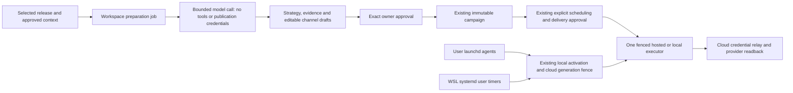

# Native runtime and grounded preparation delivery

Started 1 October 2026 from application `928b0a656d26d2ca71e01c650a88c98c7a9144fe`
and showcase `4ccd9459f9980d1a31e9d60ca29885d7935ba86c`.

## Ownership and authority

`AyobamiH/poststeward` owns the installer, embedded Python runtime, hosted
workspace/credential custody, preparation jobs and owner editorial UI.
`AyobamiH/poststeward-showcase` owns public support claims and distribution
refresh. The user's original `post-once` installation is an independent reference:
this work neither modifies its state nor installs/stops its services.



## Starting gap register

| Capability | Implemented/integrated at baseline | Existing proof | Remaining proof |
|---|---|---|---|
| Linux installer, pairing, cloud relay and A–K safety | Yes | Linux automated suites; separate historical cloud evidence | New distributed owner/provider acceptance |
| macOS immutable archive installation | Mostly portable installer | None on native macOS | BSD tools, shells, paths, lifecycle and native service execution |
| macOS unattended activation | No: systemd-only admission/controller | None | Native launchd behind existing authority |
| WSL installation | Linux implementation and some browser support | No representative acceptance | Real WSL 2 filesystem/service/network/lifecycle |
| Production content preparation | Reviewed template substitutions | Automated deterministic tests | Original release interpretation and editorial workflow |
| Optional local model calls | `reply_model.py`, explicit OpenAI API key | Source implementation only for this task | Not integrated into hosted preparation; no verified commercial/key access |
| Hosted model access | No verified binding | Development environment has no application key; production environment secret metadata API returns 403 | Owner's cost/access decision and protected credential, without secret disclosure |

Implemented, locally tested, native tested, deployed and live provider tested are
different claims. The acceptance matrix below remains conservative until evidence
is recorded. No support warning is removed merely because a platform flag passes.

## Research decisions

Documentation HTTP endpoints are blocked by the environment proxy. Targeted
domain additions were saved to the environment draft; that does not grant access.
The official source repositories below were retrieved through existing GitHub
access. Local source snapshots are in `/workspace/setup-logs/platform-ai/research`.

| Problem/outcome | Primary source and insight | Choice, fit and trade-off | Acceptance |
|---|---|---|---|
| macOS background jobs must not bypass owner authority | [Apple launchd plist manual](https://github.com/apple-oss-distributions/launchd/blob/main/man/launchd.plist.5): argument arrays, interval jobs, private umask | User LaunchAgents; fixed argument arrays and private owned files. Reuse activation stage/arm/attest protocol. No global daemon or wake/sleep promise. Manual is historical; native current-OS execution validates supported behavior. | Real arm64/x86_64 runner load, stop, restart; inactive marker prevents effects |
| WSL must not promise an always-on server | [Microsoft WSL systemd guidance](https://github.com/MicrosoftDocs/WSL/blob/main/WSL/systemd.md), [filesystem guidance](https://github.com/MicrosoftDocs/WSL/blob/main/WSL/filesystems.md), [networking](https://github.com/MicrosoftDocs/WSL/blob/main/WSL/networking.md) | WSL 2, Ubuntu 24.04 Linux filesystem and reachable user systemd. No automatic shutdown/linger configuration. Windows/distro shutdown interrupts operation. | Native Windows→WSL 2 provisioning, kernel evidence, installation and user services |
| Clear repeatable installation | [OpenClaw actual installer guidance](https://github.com/openclaw/openclaw/blob/main/docs/install/installer.md) and [uninstall](https://github.com/openclaw/openclaw/blob/main/docs/install/uninstall.md): private runtime, explicit lifecycle and success only after verification | Keep exact public archive/tree digest and isolated paths; actionable Python prerequisite, portable symlink resolution, safely quoted paths. Do not copy automatic sudo/profile edits or introduce Node into the Python runtime. | Fresh/repeat install, failure leaves current runtime intact, paths with spaces/apostrophes |
| Native OS proof must be real | [GitHub runner image inventory](https://github.com/actions/runner-images#available-images): macOS 15/26 arm64 and Intel labels | Standard public-repository macOS runners and Windows WSL provisioning; no large paid runners or Linux simulation labelled native. | Native platform workflow logs include OS, architecture and exact revision |
| Original drafts need machine-checkable structure | [OpenAI generated Responses JSON Schema types](https://github.com/openai/openai-python/blob/main/src/openai/types/responses/response_format_text_json_schema_config.py) | Structured generation plus independent server validation and owner review. Structure alone does not establish factual correctness. Model cost/access must be explicit. | Evidence references, unsupported claim rejection, model failures never become template success |
| Durable jobs and bounded cost | [Cloudflare Durable Object rules](https://github.com/cloudflare/cloudflare-docs/blob/main/src/content/docs/durable-objects/best-practices/rules-of-durable-objects.mdx) | Existing per-workspace SQL state/alarm coordinator; durable phase transitions, bounded input/output and no blind retries of uncertain calls. No new workflow infrastructure. | Restart/resume, concurrent/idempotent requests, revoked authority and quotas |

## Milestones and acceptance

1. Map evidence and research; implement portable native services and installation
   recovery. Run representative native CI without production provider effects.
2. Implement evidence selection, strategy/drafting/checking and owner review;
   verify model funding/access before live calls.
3. Evaluate representative and adversarial releases against templates. Label
   fixtures/model-assisted reviews honestly; real model outputs require real access.
4. Complete protected CI and production delivery, refresh branded distribution,
   read back exact deployed commits and publish only supported platform claims.

## Native acceptance matrix

| Environment | Install | Service lifecycle | Owner pairing/provider effect | Status |
|---|---|---|---|---|
| macOS 15.7.9 Apple Silicon | Passed | launchd load/stop/restart and worker exit 3 | Unverified | Native guarded lifecycle passed |
| macOS 15.7.9 Intel | Passed | launchd load/stop/restart and worker exit 3 | Unverified | Native guarded lifecycle passed |
| macOS 26.6.2 Apple Silicon | Passed | launchd load/stop/restart and worker exit 3 | Unverified | Native guarded lifecycle passed |
| macOS 26.6.1 Intel | Passed | launchd load/stop/restart and worker exit 3 | Unverified | Native guarded lifecycle passed |
| WSL 2.7.14 / Ubuntu 24.04 x86_64 | Passed | systemd user timers and worker exit 3 | Unverified | Native guarded lifecycle passed |

Python 3.10+ is required. Installer never silently installs administrator packages
or edits shell profiles. macOS uses the current user's desktop launchd domain;
jobs stop when logged out and do not guarantee operation during sleep. WSL
background jobs stop when Windows or the distribution shuts down. Use Linux
filesystem locations rather than `/mnt/c` for private durable state. Optional
local keyring integration is not proof that hosted provider credentials are local:
the canonical runtime holds only a scoped pairing token in a private file;
provider OAuth secrets stay in cloud custody.


Native lifecycle evidence: [run 36821297895](https://github.com/AyobamiH/poststeward/actions/runs/36821297895),
exact candidate `0c21cd612cf28e1073880ebd43a1e9d53f44b225`.
All five jobs installed real HTTPS archives under paths with spaces/apostrophes,
repeated installation, upgraded from exact retained `06fb738b71db4782f4b2f7066814b2aa7ea8cb7e`,
reviewed rollback, preserved durable evidence, repaired an injected interrupted
metadata update and exercised retain/delete-data uninstall. Real HTTP failure and
injected truncated-download failure preserved the old command/receipt. Native
loopback setup and occupied-port refusal, private 0600 pairing storage and expired-token
preflight passed. Host proof includes flock, fsync, SQLite and user service reachability.
The macOS runner Python was 3.14.7; WSL Python was 3.12.3. Separate full runtime
regressions run on 3.10 and 3.12. macOS 14/earlier, other WSL distributions, Windows
native PowerShell, real Keychain integration, missing/incompatible dependency
acceptance, Windows-browser forwarding and sleep/logout recovery remain unverified.
The native test does not approve an owner or publish to a provider.

## Workspace-funded preparation

The owner selected **each workspace connects its own model API account**. No
shared company model key or company-paid inference is configured. A ChatGPT
subscription is not API access. Owner connection encrypts an OpenAI key using the
existing root/version/context mechanism (`workspace:model:openai`), participates
in root rotation and is invalidated by cloud recovery. No key is returned in
status/export, delegated to agents, put in model material or public metadata.
Connection is not a billed authentication probe; the first successful generation
establishes actual API access. GBP service pricing remains separate and undecided.

```mermaid
sequenceDiagram
    Owner->>Workspace: Connect own OpenAI API key, quota and agent-spend consent
    Workspace->>Workspace: Encrypt key; reserve bounded allowance for a job
    Owner->>Workspace: Select published release, optional previous tag/docs, audience/context
    Workspace->>GitHub: Bounded read; pin release/tag commit SHA
    Workspace->>OpenAI: Interpret facts, audience problem, implications and strategy
    Workspace->>OpenAI: Write original selected-channel drafts with exact source quotes
    Workspace->>OpenAI: Check every assertion, voice, audience and confidentiality
    Workspace->>Owner: Private strategy, evidence, coverage gaps, drafts and usage
    Owner->>Workspace: Edit/regenerate/reject; check changed text
    Owner->>Workspace: Approve exact saved revision and digest
    Workspace->>Workspace: Freeze immutable campaign; no delivery reservation
    Owner->>Workspace: Separate explicit schedule/publication review
```

The fixed Responses model is `gpt-4.1-mini-2025-04-14`, structured JSON, no tools,
`store:false`, fixed HTTPS destination and no redirects. Maximum model material is
48,000 UTF-8 bytes; maximum output is 4,000 tokens/call. The owner permits 1–8
preparation/regeneration requests per UTC day. Full jobs reserve three calls; each
regeneration reserves its remaining phase bound. Conservative maximum token
reservations persist across key changes and the midnight boundary. Optional USD
estimates/budgets require the owner's current provider rates; invoices remain
truth. `store:false` does not promise zero provider retention or override provider
commercial/data-processing terms.

Release evidence is limited to a release/tag commit, optionally 12 compared commit
messages and 8 non-sensitive file patches, and 3 explicit text documentation paths.
Private sources require an already-linked workspace GitHub repository plus explicit
owner disclosure; unreleased material has a separate owner-only disclosure flag.
Known credentials, secret-bearing paths and email-like customer information are
excluded. Truncation/omissions are visible. This is bounded screening, not a guarantee
that arbitrary private source contains no confidential facts; owners must inspect
selected material and their provider's terms. Source text is untrusted data. It
cannot acquire model tools, provider secrets, executor authority or publication permission.

Durable source → interpretation → draft → check phases reserve/claim before external
I/O. Revoked grants, changed model authority, disconnect and rejected revisions fence
in-flight results. An expired/uncertain call is terminal until explicit regeneration;
there is no automatic paid retry or template-success substitution. API auth rejection,
rate limiting, malformed/incomplete output and oversized material are explicit errors.

Exact evidence quote matching checks references; a separate model-assisted critique
checks all draft assertions. Neither proves semantic truth. Owner review remains
mandatory before immutable campaign handoff. Changing saved text invalidates checking;
unsaved edits survive status refresh and cannot be approved. Individual variants may
be removed or regenerated. Live account bindings and the existing X/Threads multipart
and LinkedIn single-post constraints are rechecked before handoff. Unsupported
LinkedIn provider authority remains an external blocker, not an inferred capability.

Cloud editorial project context is explicitly separate from local execution truth.
In local mode the workspace does not call or display hosted schedules/profiles as
local state. It still supports preparation and owner review. Approved variants can
be exported and imported with `poststeward preparation import`, explicit local
project/campaign/account selection and a new exact local review digest. Workspace,
cloud binding/version and local stable identity must match. Local imports remain
manual-only and freeze the expected destination identity; later registry drift fences
the campaign. Import does not call a model, allocate or schedule. Exports are not
signed provenance; explicit local owner review is authoritative. Oversized variants
can encounter conservative existing local X text limits, which remain fail-closed.

Jobs are private and list at most 100 retained preparations. Owners can download an
exact private export and remove a terminal preparation by its current digest. Removal
retains immutable campaigns, receipts, spending and existing operation history; it
is not workspace erasure. Workspace erasure remains the separate reviewed workflow.
Historical deterministic Advanced templates remain a clearly labelled optional
continuing-automation format; they are not the new AI preparation implementation.

## Quality evaluation and remaining acceptance

`tests/fixtures/preparation/releases.json` contains eight **authored synthetic**
reference cases: feature, bug fix, maintenance, breaking, security-sensitive,
ambiguous, large mixed and adversarial. `node --experimental-transform-types
scripts/evaluate-preparation.ts --references` compares their authored drafts against
the old substitution baseline and validates X part constraints with **zero model
calls**. Eight distinct authored examples show the intended editorial distinction;
they do not prove the model generates them. Tests inject structured synthetic model
responses to exercise the actual pipeline, evidence failures, independent checking,
quotas, grants, key recovery and immutable handoff.

Live evaluation is explicit (`--live` with a privately configured
`POSTSTEWARD_EVALUATION_API_KEY` belonging to the approved workspace account), at most
24 calls/4,000 output tokens each, no publication, no retries. No live model key or
owner browser session has been supplied in this environment. Therefore real model
output quality/authentication, human editorial review, audience usefulness and
marketing effectiveness remain **unverified**. The deployed owner UI provides the
secure connection path; no secret should be pasted into chat. An owner can complete
that acceptance by connecting their own account, selecting representative real
releases, reviewing source support and editing/freezing the final copy. A real
Mac/WSL owner pairing → local executor → scheduled provider effect → matching local
and cloud readback still needs that owner's accounts and approval.

## Delivery and rollback

Deliver the exact green PR through protected main CI, deployment preflight and
Cloudflare Worker upload, then refresh the showcase stable distribution to the
same application revision. No new global model secret, infrastructure or database
migration is required. Read `/health` and all branded stable manifests independently.
Availability sampling covers app, apex and www; it cannot prove uninterrupted
availability between samples.

Cloud rollback uses the established protected deployment workflow for the previously
verified application revision `928b0a656d26d2ca71e01c650a88c98c7a9144fe`, plus matching
showcase distribution refresh. The old worker does not run new preparation phases;
disconnect model access/pause generation before rollback and inspect uncertain
provider calls. Existing immutable campaigns and external-effect receipts remain.
Local rollback requires inactive reviewed cloud/local authority and the exact returned
review digest. Only runtime software changes; durable state is never rolled back.
If interrupted between current/receipt/shim writes, remain inactive and rerun the
exact verified installer to repair metadata before another activation review.
Uninstall removes the current and previous managed archive; older retained archives
and unrelated prefix files can remain for manual review. Delete-data is an explicit
choice and cannot revoke provider/cloud grants; revoke the inactive machine in the
owner workspace separately.
