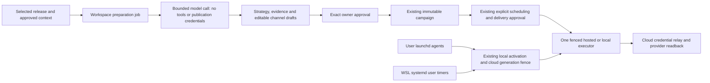

# Native runtime and grounded preparation delivery

Started 1 October 2026 from application `928b0a656d26d2ca71e01c650a88c98c7a9144fe`
and showcase `4ccd9459f9980d1a31e9d60ca29885d7935ba86c`.

## Ownership and authority

`AyobamiH/poststeward` owns the installer, embedded Python runtime, hosted
workspace/credential custody, preparation jobs and owner editorial UI.
`AyobamiH/poststeward-showcase` owns public support claims and distribution
refresh. The user's original `post-once` installation is an independent reference:
this work neither modifies its state nor installs/stops its services.

## Starting gap register

| Capability | Implemented/integrated at baseline | Existing proof | Remaining proof |
|---|---|---|---|
| Linux installer, pairing, cloud relay and A–K safety | Yes | Linux automated suites; separate historical cloud evidence | New distributed owner/provider acceptance |
| macOS immutable archive installation | Mostly portable installer | None on native macOS | BSD tools, shells, paths, lifecycle and native service execution |
| macOS unattended activation | No: systemd-only admission/controller | None | Native launchd behind existing authority |
| WSL installation | Linux implementation and some browser support | No representative acceptance | Real WSL 2 filesystem/service/network/lifecycle |
| Production content preparation | Reviewed template substitutions | Automated deterministic tests | Original release interpretation and editorial workflow |
| Optional local model calls | `reply_model.py`, explicit OpenAI API key | Source implementation only for this task | Not integrated into hosted preparation; no verified commercial/key access |
| Hosted model access | No verified binding | Development environment has no application key; production environment secret metadata API returns 403 | Owner's cost/access decision and protected credential, without secret disclosure |

Implemented, locally tested, native tested, deployed and live provider tested are
different claims. The acceptance matrix below remains conservative until evidence
is recorded. No support warning is removed merely because a platform flag passes.

## Research decisions

Documentation HTTP endpoints are blocked by the environment proxy. Targeted
domain additions were saved to the environment draft; that does not grant access.
The official source repositories below were retrieved through existing GitHub
access. Local source snapshots are in `/workspace/setup-logs/platform-ai/research`.

| Problem/outcome | Primary source and insight | Choice, fit and trade-off | Acceptance |
|---|---|---|---|
| macOS background jobs must not bypass owner authority | [Apple launchd plist manual](https://github.com/apple-oss-distributions/launchd/blob/main/man/launchd.plist.5): argument arrays, interval jobs, private umask | User LaunchAgents; fixed argument arrays and private owned files. Reuse activation stage/arm/attest protocol. No global daemon or wake/sleep promise. Manual is historical; native current-OS execution validates supported behavior. | Real arm64/x86_64 runner load, stop, restart; inactive marker prevents effects |
| WSL must not promise an always-on server | [Microsoft WSL systemd guidance](https://github.com/MicrosoftDocs/WSL/blob/main/WSL/systemd.md), [filesystem guidance](https://github.com/MicrosoftDocs/WSL/blob/main/WSL/filesystems.md), [networking](https://github.com/MicrosoftDocs/WSL/blob/main/WSL/networking.md) | WSL 2, Ubuntu 24.04 Linux filesystem and reachable user systemd. No automatic shutdown/linger configuration. Windows/distro shutdown interrupts operation. | Native Windows→WSL 2 provisioning, kernel evidence, installation and user services |
| Clear repeatable installation | [OpenClaw actual installer guidance](https://github.com/openclaw/openclaw/blob/main/docs/install/installer.md) and [uninstall](https://github.com/openclaw/openclaw/blob/main/docs/install/uninstall.md): private runtime, explicit lifecycle and success only after verification | Keep exact public archive/tree digest and isolated paths; actionable Python prerequisite, portable symlink resolution, safely quoted paths. Do not copy automatic sudo/profile edits or introduce Node into the Python runtime. | Fresh/repeat install, failure leaves current runtime intact, paths with spaces/apostrophes |
| Native OS proof must be real | [GitHub runner image inventory](https://github.com/actions/runner-images#available-images): macOS 15/26 arm64 and Intel labels | Standard public-repository macOS runners and Windows WSL provisioning; no large paid runners or Linux simulation labelled native. | Native platform workflow logs include OS, architecture and exact revision |
| Original drafts need machine-checkable structure | [OpenAI generated Responses JSON Schema types](https://github.com/openai/openai-python/blob/main/src/openai/types/responses/response_format_text_json_schema_config.py) | Structured generation plus independent server validation and owner review. Structure alone does not establish factual correctness. Model cost/access must be explicit. | Evidence references, unsupported claim rejection, model failures never become template success |
| Durable jobs and bounded cost | [Cloudflare Durable Object rules](https://github.com/cloudflare/cloudflare-docs/blob/main/src/content/docs/durable-objects/best-practices/rules-of-durable-objects.mdx) | Existing per-workspace SQL state/alarm coordinator; durable phase transitions, bounded input/output and no blind retries of uncertain calls. No new workflow infrastructure. | Restart/resume, concurrent/idempotent requests, revoked authority and quotas |

## Milestones and acceptance

1. Map evidence and research; implement portable native services and installation
   recovery. Run representative native CI without production provider effects.
2. Implement evidence selection, strategy/drafting/checking and owner review;
   verify model funding/access before live calls.
3. Evaluate representative and adversarial releases against templates. Label
   fixtures/model-assisted reviews honestly; real model outputs require real access.
4. Complete protected CI and production delivery, refresh branded distribution,
   read back exact deployed commits and publish only supported platform claims.

## Native acceptance matrix (initial)

| Environment | Install | Service lifecycle | Owner pairing/provider effect | Status |
|---|---|---|---|---|
| macOS 15 Apple Silicon | Pending native workflow | Pending launchd workflow | Unverified | Acceptance pending |
| macOS 15 Intel | Pending native workflow | Pending launchd workflow | Unverified | Acceptance pending |
| macOS 26 Apple Silicon | Pending native workflow | Pending launchd workflow | Unverified | Acceptance pending |
| macOS 26 Intel | Pending native workflow | Pending launchd workflow | Unverified | Acceptance pending |
| WSL 2 Ubuntu 24.04 | Pending native provisioning | Pending reachable systemd user manager | Unverified | Acceptance pending |

Python 3.10+ is required. Installer never silently installs administrator packages
or edits shell profiles. macOS uses the current user's desktop launchd domain;
jobs stop when logged out and do not guarantee operation during sleep. WSL
background jobs stop when Windows or the distribution shuts down. Use Linux
filesystem locations rather than `/mnt/c` for private durable state. Optional
local keyring integration is not proof that hosted provider credentials are local:
the canonical runtime holds only a scoped pairing token in a private file;
provider OAuth secrets stay in cloud custody.
